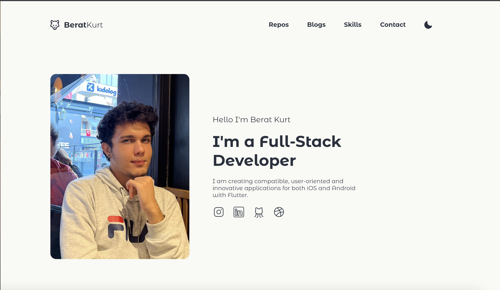
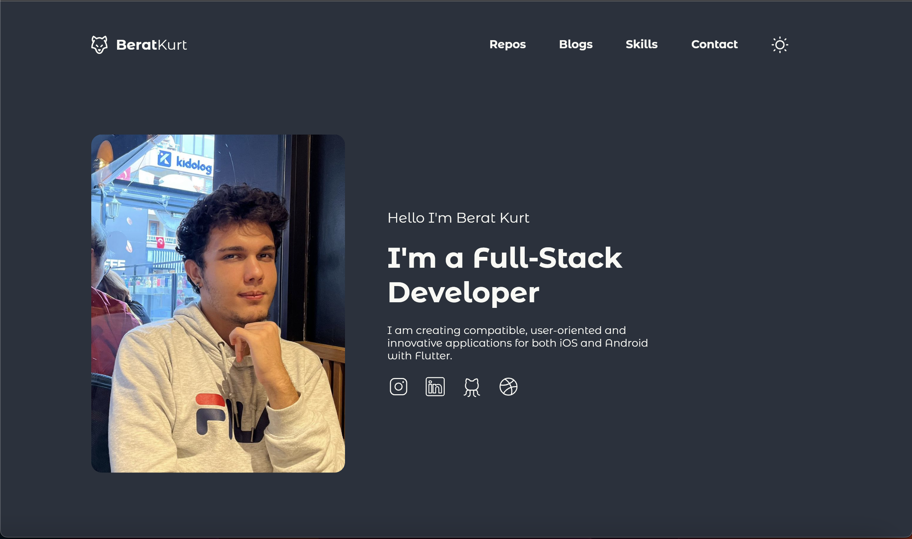
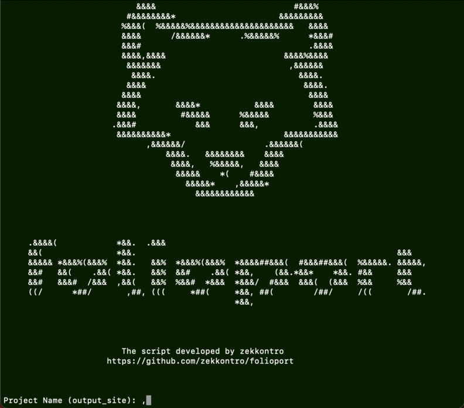

# Folioport

***You can prepare your developer portfilo site in 5 minutes***

<br />






## Setup

1- Clone the proje

```
git clone https://github.com/zekkontro/folioport_generator.git
```
<br />

2- Download requirements with this code

```
pip3 install -r requirements.txt
```
<br />

3- Run the generator.py file and

```
python3 generator
```
<br />

4- Enter the site data with using script



<br />

5- Deploy your portfolio

You can use Github Pages or Firebase Hosting

[Flutter Document Link](https://flutter.dev/docs/deployment/web#deploying-to-the-web)

[Firebase Hosting](https://firebase.google.com/docs/hosting)

[Github Pages](https://pages.github.com/)

<br />

## Author

##### Mustafa Berat Kurt - zekkontro

##### [Github Page](https://github.com/zekkontro)

##### [Instagram Page](https://www.instagram.com/brtwlf/)
